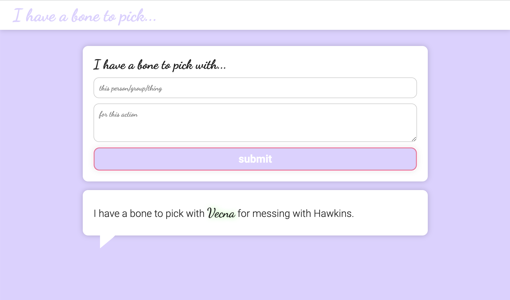

# I have a bone to pick... MongoDB version

Vent all of your irritations in a safe and anonymous forum!

A continuation of simple json database version of [IHABTP](https://github.com/smithse4/IHABTP).

Converted database to Mongo DB.

